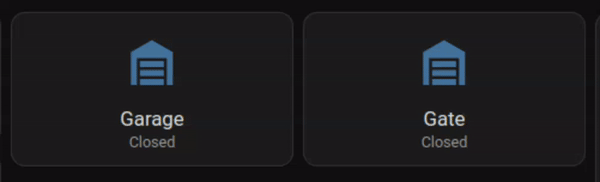
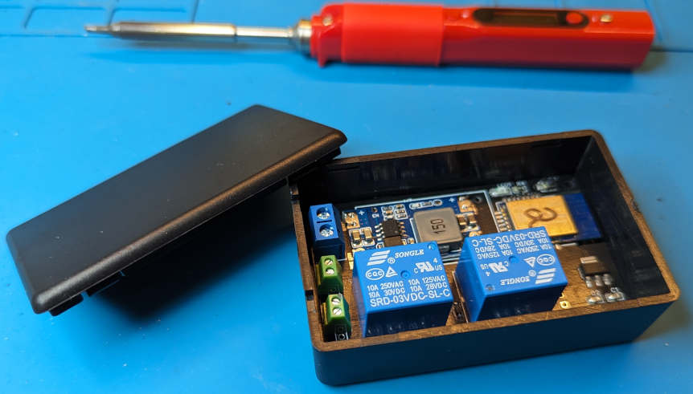
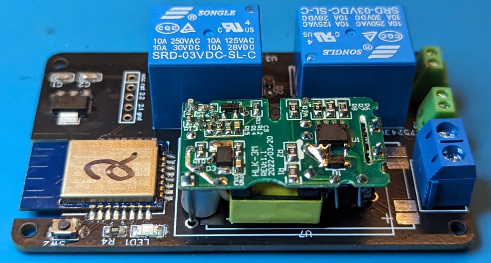
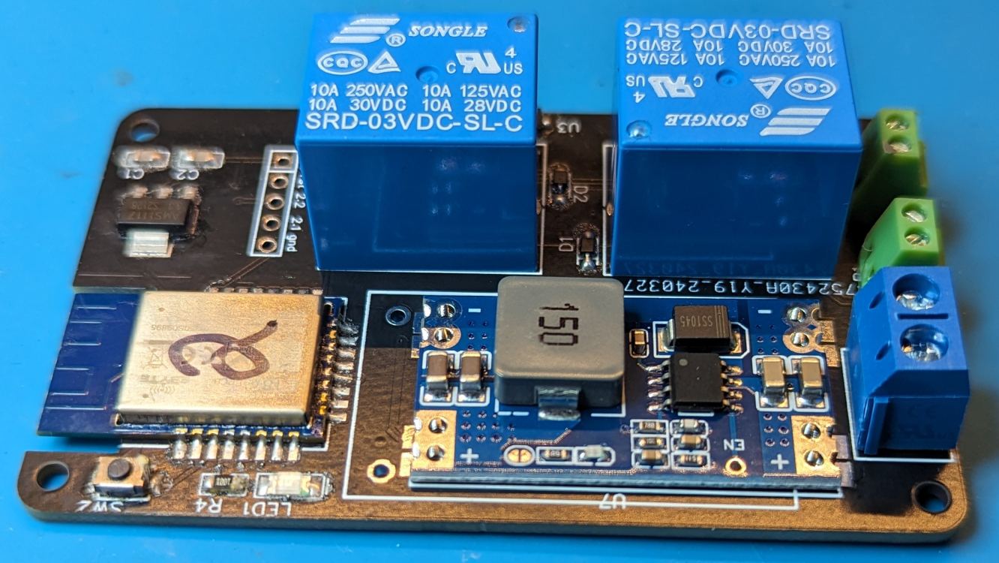
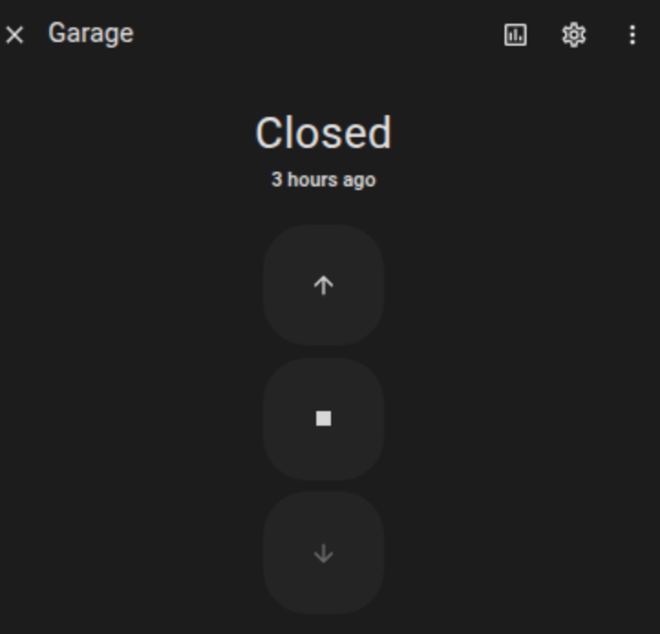
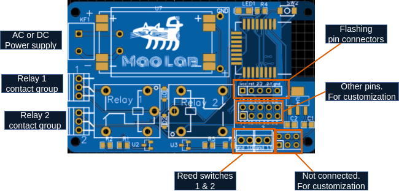

# Zigbee Garage Door Opener
This is a DIY Zigbee garage door opener, designed for use with Home Assistant and [Zigbee2MQTT](https://www.zigbee2mqtt.io/).  
  
It supports any dry-contact-operated garage door or other device that requires a dry contact. The device includes two switches for relays and two door sensors (reed switches) for feedback. Each switch functions as a pulse switch when activated: it triggers the relay for 300 ms and then turns off.
**!! This repository is currently under development, stay tuned !!**

Disclaimer: This project is provided as is. The author is not responsible for any damage caused by the project. Wiring might be dangerous due to high voltage and must be done by a professional.




## Power Supply
The single PCB design supports three options. Choose the one that fits your needs:
1. **HLK-PM01** for 220v input
2. **Mini560 Pro 5v** for 6-32v input
3. Directly solder the power supply to the **+** and **GND** pads for 3.3v-12v input. In this case, voltage step-down will be done by the built-in linear voltage regulator **AMS1117-3.3V**.
  

## Components
| **Component**         | **Description**                                                                    | 
|-------------------|------------------------------------------------------------------------------------|
| Zigbee Module     | **CC2530** based chip:<br/>E18-MS1-PCB<br/>E18-MS1-IPX (for external antenna)      |
| Power Supply 220v | HLK-PM01 5v                                                                        |  
| Power Supply 5v   | Mini560**Pro** for 6-32v -> 5v                                                     |  
| Terminals         | K-301-2P for power supply<br/>KF128-2.54-2P (2P or 3P) for relay and reed switches |
| Tact push Button  | SMD 2pin 3x4mm [Aliexpress](https://www.aliexpress.com/item/32633728422.html)      |
| Relay             | SRD-03VDC-SL-C **3v**                                                              |
| Reed Switches     | PS-3150                                                                            |
| Enclosure         | 80x50x26 mm [Aliexpress](https://www.aliexpress.com/item/1005002656761229.html)    |

Refer to the BOM file for other.

## Firmware
The firmware is based on the [PTVO](https://ptvo.info/) project. Please consider supporting the author.
There are two almost equal firmware versions:
1) stock PTVO - does not require external converter for Zigbee2MQTT. The downside is that reed switches are exposed as regular switches.
2) custom - requires a custom converter for Zigbee2MQTT. The reed switches are exposed as door sensors.

### Flashing
You will need a CC Debugger (find one on Aliexpress) and [SmartRF Flash Programmer](https://www.ti.com/tool/FLASH-PROGRAMMER) **_V1_** to flash the firmware. Refer to the user manual [here](https://ptvo.info/how-to-select-and-flash-cc2530-144/).
## Pairing
Option 1: Flash the device, and it will boot in pairing mode  
Option 2: Press and hold the tact button on the pcb for 10 seconds, until the LED starts blinking every 1 second.

When the device is paired, the LED will blink every 5 seconds.
## Operating
The best way to operate this device with Home Assistant is creating a garage door entity with [template cover](https://www.home-assistant.io/integrations/cover.template/) in your `configuration.yaml`.
```yaml
cover:
  - platform: template
    covers:
      garage_door:
        device_class: garage
        unique_id: cover.garage_door
        friendly_name: "Garage Door"
        position_template: "{{ {'on': 100, 'off':0}.get(states('binary_sensor.garage_door_contact'))  }}"
        open_cover:
          - action: switch.turn_on
            target:
              entity_id: switch.garage_l2
        close_cover:
          - action: switch.turn_on
            target:
              entity_id: switch.garage_l2
        stop_cover:
          action: switch.turn_on
          target:
            entity_id: switch.garage_l2
        icon_template: >-
          
            mdi:garage-open
          
            mdi:garage
            
```




## Wiring
**Attention:** This project involves high voltage wiring. It must be done by a professional.  



## Customization

The PCB supports customization with additional pins. Nothing stops you from adding more reed switches straight out of the box. it will require a bit of soldering though. The firmware will need to be adjusted accordingly.


## Contributing
Contributions are welcome.
- [ ] 🌟 Star the repository if you liked it 
- [ ] Test the device
- [ ] Documentation
- [ ] PCB improvements

## Support / Buy
- Consider buying coffee to the authors of [PTVO](https://ptvo.info/) and [Zigbee2MQTT](https://www.zigbee2mqtt.io/).
- Buy this device at Tindie (coming soon) 