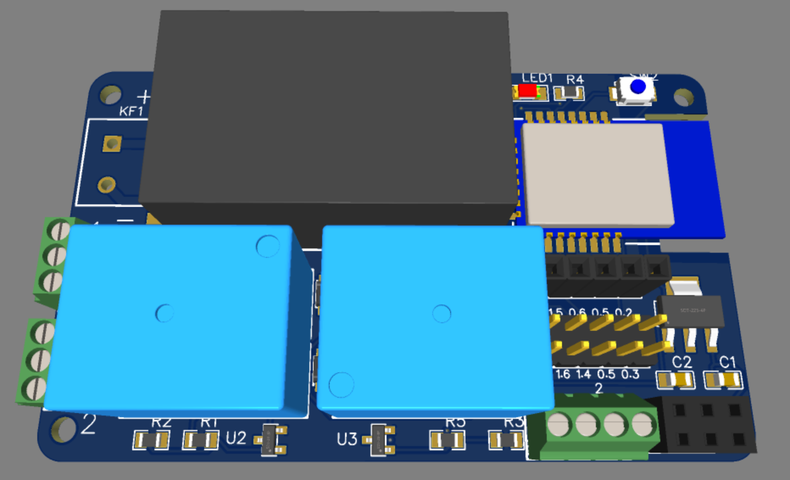

!! **ATTENTION** !!  
This is a secon iteration of the PCB. It has not been tested yet. Firmware is coming after the testing, but feel free to configure your own with PTVO.     
There is also revision 1.0 of the PCB, which is tested and working, but does not have reed switch support and does not support customization with additional pins.  
Stay tuned for updates.  

  
  
  

# Components
Please, refer to the **BOM** file.

- Enclosure: [80x50x26 mm](https://www.aliexpress.com/item/1005002656761229.html)
- CC2530: E18-MS1-PCB; E18-MS1-IPX; or other compatible module.
- Power supply: **HLK-PM01** for 220v or **Mini560 Pro 5v** for 6-32v
- Terminals: K-301-2P for power supply and KF128-2.54-2P (3P) for relay and reed switch.
- Reed Switch sensors: [PS-3150](https://www.aliexpress.com/item/4000209658438.html)
- Tact push button: [Aliexpress](https://www.aliexpress.com/item/32633728422.html)
